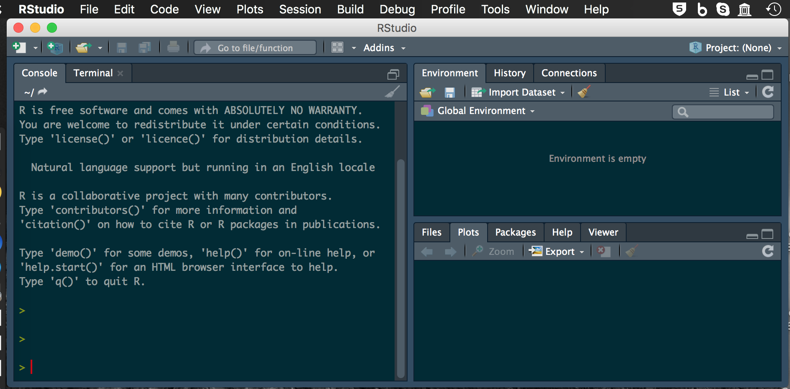
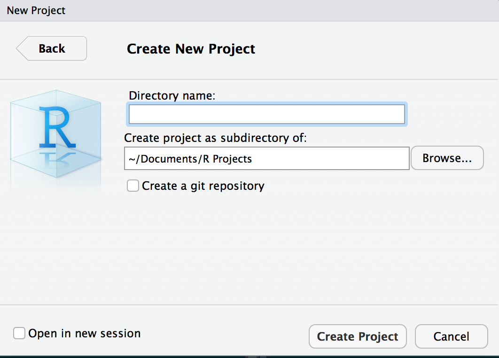
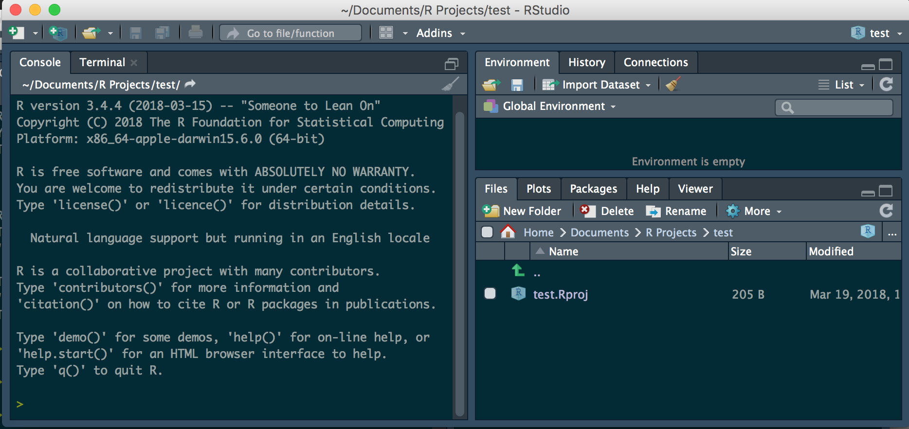
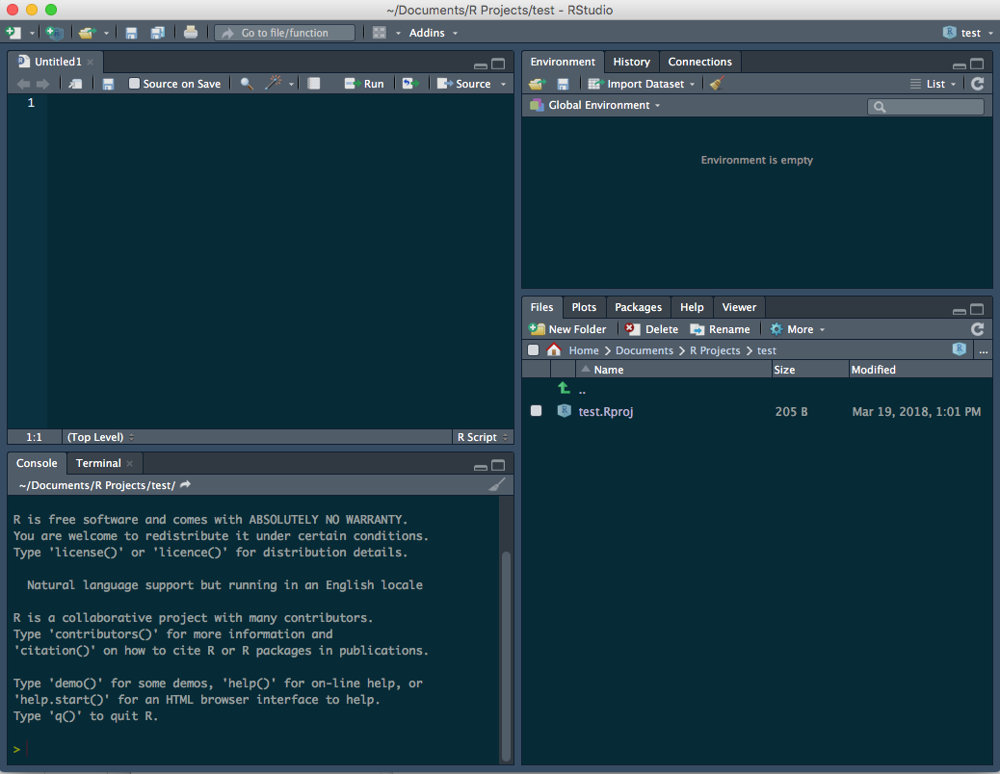

Designing a project from the ground up.      

##Steps to consider    

So the first thing to think about in my opinion is the workflow or dataflow:   

  1. What is the source and format of your data? 
      + what are the variables
      + controlled vocabulary list
      + data structure in columns
  2. What is the final objective and use of your data and what output?     
      + what is the most flexible output     
      + graphs     
      + summary statistics     
      + statistical analyses      
  3. What is the flow of data      
      + source and update frequency     
      + QA/QC and flagging of data     
      + Transformations or calculations to be made     
      + Final data output for use - note never write to original dataframe     
      + Summary statistics     
      + Graphs     
      + Statistical Analyses     
      + Reports with markdown     
      + Annotate scripts and metadata     
  4. Set up directory structure 
      + R Project Directory
        - Scripts
        - Documents
        - Data
        - Figures / output
        - Finalized Data
      
##Data Source Format
###Controlled vocabulary and units   

Thinking about your data source first is important. Using a controlled vocabulary to reference the variables is critical and will save huge amounts of time when modifying the code later on. I find it helpful to have a meta data document with the vocabulary and the units for each term so that future users can figure out what your code means. 

###Transformations    

Keeping a list of transformations can be helpful in coding and if it is in the meta data file, you can copy the transformations out of the document and if there are mistakes people can track it down fast. 

###Data structure and format

R uses a column format and all the data in a column has to be of the same type. The most common data formats you will run into are:        

  + Numeric - can be double or integer but that is not as important
  + Character - text fields
  + Factors - displayed often as text but is as levels behind the scenes
  + Date - date format or POSIXLT
      - note this is in days since 1970-01-01 I believe
  + Date time - date and time format together or POSIXCT 
      - this is in seconds since 1970-01-01 00:00:00
      - this will be critical for many of you
      
      
  **Note that if you mix formats within a column some of the variables will be converted to NA if say you have a column that is a character column which has mixed numbers and text and is then converted to numeric**     
  
  
###Output     

I find it useful to maintain a read only file of the original data and never write to this file other than the original QA/QC flagging of the data if even then. I usually read from this file and save it to the finalized data folder where the data has been cleaned formatted and basic calculations done on it.

##Data Flow    

It is often very helpful prior to doing any code work to think about what the final output will look like and what the original data looks like and the steps between these two points. 

###Wide format original data    

Typically when we enter data it is in **wide format** where an identifier is down the first column and the various variables are in separate columns. This is what is often easiest to enter into excel or wherever it is entered originally. 

This format is often more difficult to work with in R and GGPlot so it is converted to **long format** where there is a column of identifiers, a column of variable names, and a column of values. The switch between these formats is often rather easy so it does not matter what format it is in.

##Annotations and metadata files    

For the love of all that is good - be sure to annotate you code using the # and whatever text helps describe the process you are doing - it will make the code easier to read and evaluate later when you are trying to figure out something really fast. You can also use it to search for code snippets as you are going along.

Metadata files that document what you are doing and why and what the various conversions and statistical transformations are can be of great use later on as well. It is often challenging to figure out what the units are in for various variables or what they actually mean.

##Directory structure    

Having a consistent directory structure where code, data, and text is stored makes it easy to look at different directories and find what you are looking for. That is why I use the following structure. Choose what works for you and stick with it... please   

 + R Project Directory
        - Scripts
        - Documents
        - Data
        - Figures / output
        - Finalized D    
        
        
Using projects in R is super useful and you don't have to worry about setting directories between a mac and windows machine and all the paths are relative in there when you reference data or output directories and is the same on windows and mac.

##File names
From the site [File organization and best practices](https://andrewbtran.github.io/NICAR/2018/workflow/docs/01-workflow_intro.html?utm_content=buffer858fd&utm_medium=social&utm_source=twitter.com&utm_campaign=buffer) and [Prime Hints](https://kkulma.github.io/2018-03-18-Prime-Hints-for-Running-a-data-project-in-R/)  naming files has many good practices. Of these the main theme is:    

1. Use a consistent naming theme
  a. use date_term1_term2.xxx
  b. no spaces or other fancy characters
  c. make the names human understandable
2. Use natural ordering of files
  a. use date at front or somewhere so you know the version
  b. use logical ordering like 01_ 02_ 03_
3. Avoid things like 
  a. final thesis proposal.docx - I deal with many students and this is not helpful
  

##RStudio Specifics     
###Outline your code to navigate    
You can write a comment `#` and then follow it with `text` and then 4 dashes `----` or `####` and it will create a note in the outline view

###Comment your code     
You should use comments `#` with text behind it to annotate the purpose of what your are doing and what is happening in the code chunk below.

##Installing R
So lets start installing R and R studio    
R is its own program and can be retrieved from [R Cran](https://cran.r-project.org/)   
    
R Studio is a program that makes the interface and usability of R easier in my opinion and can be retrieved here [R Studio](https://www.rstudio.com/products/rstudio/download/)    

 
When you get these installed we can load up R studio and look at the interface.   

###R interface 
Start R studio and you should see:

###Project Setup
Now to set up a new project - this is if the directory does not exist
Click:
1. File 
2. New Project

   
   You can select `New Directory` or you can select existing directory - lets say you choose new directory
      
   
 For now you are doing a `New Project `.  We will talk about Github at a later date    
 
 
   
   
  Interface changes only slightly - look in the upper right    
       
   
   
###Scripts       
Now we can create a new script      

1. File 
2. New file
3. R Script

 
 
 Now the interface looks like
  
   
###Install Libraries
The key to R in my opinion is to install libraries. We will practice with one and your homework is to install the others.     

You will type:     
`#install libraires ----`      
`install.packages("tidyverse")`     

`#load libraries----`     
`library(tidyverse)`     
   
   
Then after each you will hit command or control return and it will run the command or you can click run.

Here is a list of packages I have found useful     

 
`tidyverse     `    
`lubridate     `    
`readxl     `   
`scales     `    
`patchwork    `    
`janitor    `     
`skimr`            

others not loaded each time:     
`reshape2`          

other specialties    
`devtools`          

A different type of installation for the USGS data      
`install_github("USGS-R/dataRetrieval")`        
`install.packages("dataRetrieval")`      
`install.packages("dataRetrieval",`       
`repos=c("http://owi.usgs.gov/R",`       
`getOption("repos")))`   
                
                

   

   

<!-- Global Site Tag (gtag.js) - Google Analytics -->

