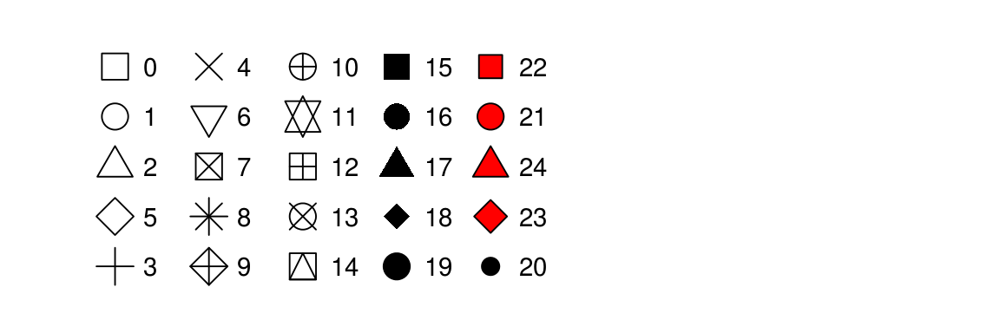

# GGPlot    
This script will go over a lot of the basics of creating graphs in GGPlot and later on we will go over how to do more specialized things. This is by no means a complete guide to GGPlot but will do most of the things that you will need to do in GGPlot. Any suggestions or recommendtions of things to add would be welcome.    


## Load Libraries    
```{r}
# load the libraries each time you restart R
library(tidyverse)
library(lubridate)
library(readxl)
library(scales)
library(skimr)
library(janitor)
library(patchwork)
```


## Read in the file
```{r 03_read_data}
# Read in file using tidyverse code-----
mm.df <- read_csv("data/mms.csv")
```


#### Read in excel files
Note that you can read in excel files in the same way.
```{r}
# Note you can read in excel files just as easy
mm_excel.df <- read_excel("data/mms.xlsx")
```


## Graphing data 
I feel that graphing is the key to all data analysis. If you can look at your data you can begin to see patterns that you may have predicted and want to test statistically. You will also be able to see outliers that exist that might affect resutls faster than looking at summary statistics.     
     
Using proper GGPlot code you are supposed to have  data=, y= and x= ....      
I have found that these are not necessary most of the time unless you put y= in different geom statements.   It is also helpful to put the name of the dataframe out front and feed it into the plotting command using a pipe operator or the `%>%`    
```{r}
mm.df %>% 
ggplot(aes(color, diameter)) +
  geom_boxplot() +
  labs(x = "color", y = "Diameter")
```

## Modifying the attributes of geometries.     
This  is where it gets interesting. If you want to add a color to the boxes as a fill or a color you can do the following. This maps a fill or color to the geometry based on the assigned variable you use
```{r}
mm.df %>% 
ggplot(aes(color, diameter, color=color)) +
  geom_boxplot() +
  labs(x = "color", y = "Diameter")
```

## Challenge     
- Now modify the fill and not the color. What would you change? 
```{r}
mm.df %>% 
ggplot(aes(color, diameter, color=color)) +
  geom_boxplot() +
  labs(x = "color", y = "Diameter")
```
## Manually adjusting the mapped attributes   
Now we can manually adjust the mapped attribute by adjusting it with a new command

```{r}
mm.df %>% 
ggplot(aes(color, diameter, color=color)) +
  geom_boxplot() +
  labs(x = "color", y = "Diameter") +
  scale_color_manual(
    name = "Shell Color",
    labels = c("Blue", "Brown", "Green", "Orange", "Red", "Yellow"),
    values = c("blue", "brown", "green", "orange", "red", "yellow")
  )
```

## Adjusting scales - scales   
This is how to adjust scales of say the Y axis. Note that if you use a range that is less than the data using this command you cut off the data an eliminate it. 
```{r}
mm.df %>% 
ggplot(aes(color, diameter, color=color)) +
  geom_boxplot() +
  labs(x = "color", y = "Diameter") +
  scale_color_manual(
    name = "Shell Color",
    labels = c("Blue", "Brown", "Green", "Orange", "Red", "Yellow"),
    values = c("blue", "brown", "green", "orange", "red", "yellow")
  ) +
  scale_y_continuous(limits = c(10,20))
```

## Adjusting scales - coord_cartesian   
Using the coord_cartesian you are zooming in on a section and not eliminating the data
```{r}
mm.df %>% 
ggplot(aes(color, diameter, color=color)) +
  geom_boxplot() +
  labs(x = "color", y = "Diameter") +
  scale_color_manual(
    name = "Shell Color",
    labels = c("Blue", "Brown", "Green", "Orange", "Red", "Yellow"),
    values = c("blue", "brown", "green", "orange", "red", "yellow")
  ) +
  coord_cartesian(ylim=c(10,14))
```

## Dates as the X Axis    
Dates  can be an issue for a lot of research and is often the most difficult thing to deal with.  This is where the scales package comes into its own. I have used a data set cleaned up from the [Vermillion River in Danvill from USGS](https://waterdata.usgs.gov/nwis/uv?site_no=03339000) . 

Read in the data
```{r}
river.df <- read_csv("data/vermillion_danville.csv")
```


```{r}
# Dates on the X-Axis -----
# So now you might want to change the axes scales
# uses the scales package
ggplot(river.df, aes(x=datetime, y=discharge_cfs)) +
  geom_line() +
  labs(x = "Date", y = expression(bold("Discharge (ft"^3*"sec"^-1*")")))
```

The key for formatting axes with dates and times using the following abbreviations
CODE	  MEANING
  -  %y	    year, without century (00-99)        
  -  %Y	    year, with century (0000-9999)        
      
  -  %m	    month, numeric (01-12)        
  -  %b	    month, abbreviated (Jan-Dec)        
  -  %B	    month, full (January-December)        
         
  -  %a	    day of the week, abbreviated (Mon-Sun)        
  -  %A	    day of the week, full (Monday-Sunday)        
  -  %e	    day of the month (1-31)        
  -  %d	    day of the month (01-31)        
  
  -  %l	    hour, in 12-hour clock (1-12)        
  -  %I	    hour, in 12-hour clock (01-12)        
  -  %H	    hour, in 24-hour clock (01-24        
    
  -  %M	    minute (00-59)        
   
  -  %S	    second (00-59)        

```{r}
# Dates on the X-Axis -----
# So now you might want to change the axes scales
# uses the scales package
ggplot(river.df, aes(x=datetime, y=discharge_cfs)) +
  geom_line() +
  labs(x = "Date", y = expression(bold("Discharge (ft"^3*"sec"^-1*")"))) +
  scale_x_datetime(date_breaks = "1 month",
        limits = as_datetime(c('2017-01-01 00:00:00','2017-12-24 24:00:00')),
        labels=date_format("%b"))
```


## Modifying themes     
The appearance of graphs is modified using theme statements

```{r}
# Themes for graphs -----
# Here we need to start setting the theme for the graph or appearance
# There are built in theme 
ggplot(river.df, aes(x=datetime, y=discharge_cfs)) +
  geom_line() +
  labs(x = "Date", y = expression(bold("Discharge (ft"^3*"sec"^-1*")"))) +
  scale_x_datetime(date_breaks = "1 month",
        limits = as_datetime(c('2017-01-01 00:00:00','2017-12-24 24:00:00')),
        labels=date_format("%b"))+
  theme_light()
```


you can try a lot of other themes    

  - theme_gray      
  - theme_bw      
  - theme_linedraw    
  - theme_light     
  - theme_dark     
  - theme_minimal    
  - theme_classic      
  - theme_void     
  - theme_test      
     
```{r}
# NOW - try a few different themes
ggplot(river.df, aes(x=datetime, y=discharge_cfs)) +
  geom_line() +
  labs(x = "Date", y = expression(bold("Discharge (ft"^3*"sec"^-1*")"))) +
  scale_x_datetime(date_breaks = "1 month",
        limits = as_datetime(c('2017-01-01 00:00:00','2017-12-24 24:00:00')),
        labels=date_format("%b"))

```

## Adusting themes
So you could as Dr. Google every theme aspect and spend hours making grpahs
Use ggtheme assistant - highlight code of graph and go to Addins    
Select ggplot Theme Assistant      

This will open a dialog box and then the code will appear below     


```{r}
ggplot(river.df, aes(x=datetime, y=discharge_cfs)) +
  geom_line() +
  labs(x = "Date", y = expression(bold("Discharge (ft"^3*"sec"^-1*")"))) +
  scale_x_datetime(date_breaks = "1 month",
        limits = as_datetime(c('2017-01-01 00:00:00','2017-12-24 24:00:00')),
        labels=date_format("%b")) 
```


## Common Theme Statments      
This is a list or statement that I use for a lot of my graphs    
```{r}
# Commonly used theme settings ------
# This is the set of theme settings I use

ggplot(river.df, aes(x=datetime, y=discharge_cfs)) +
  geom_line() +
  labs(x = "Date", y = expression(bold("Animals (No. L"^-1*")"))) +
  scale_x_datetime(date_breaks = "2 month",
               limits = as_datetime(c('2017-01-01 00:00:00','2017-12-24 24:00:00')),
        labels=date_format("%b")) +
  theme(
    # LABLES APPEARANCE
    axis.title.x=element_text(size=14, face="bold"),
    axis.title.y=element_text(size=14, face="bold"),
    axis.text.x = element_text(size=14, face="bold", angle=45, hjust=1),
    axis.text.y = element_text(size=14, face="bold"),
    # plot.title = element_text(hjust = 0.5, colour="black", size=22, face="bold"),
    # LEGEND
    legend.position="none",
    # LEGEND TEXT
    legend.text = element_text(colour="black", size = 14, face = "bold"),
    # LEGEND TITLE
    legend.title = element_text(colour="black", size=16, face="bold"),
    # LEGEND POSITION AND JUSTIFICATION 
    # legend.justification=c(0.1,1),
    # legend.position=c(0.02,.99),
    # REMOVE LEGEND BOX
    # legend.key = element_rect(fill = "transparent", colour = "transparent"), 
    # REMOVE LEGEND BOX
    # legend.background = element_rect(fill = "transparent", colour = "transparent"), 
    # #REMOVE PLOT FILL AND GRIDS
    # panel.background=element_rect(fill = "transparent", colour = "transparent"), 
    # # removes the window background
    # plot.background=element_rect(fill="transparent",colour=NA),
    # # removes the grid lines
    # panel.grid.major = element_blank(), 
    # panel.grid.minor = element_blank(),
    # ADD AXES LINES AND SIZE
    axis.line.x = element_line(color="black", size = 0.3),
    axis.line.y = element_line(color="black", size = 0.3),
    # ADD PLOT BOX
    panel.border = element_rect(colour = "black", fill=NA, size=0.3))

```

## Creating custom theme    
You can also make your own theme to avoid this every time
Theme for Graphs
Make a new default theme
```{r}
# Run this and it will store it as an object for use later
theme_class <- function(base_size = 14, base_family = "Times")
{
  theme(
    # LABLES APPEARANCE
    axis.title.x=element_text(size=14, face="bold"),
    axis.title.y=element_text(size=14, face="bold"),
    axis.text.x = element_text(size=14, face="bold", angle=45, hjust=1),
    axis.text.y = element_text(size=14, face="bold"),
    # plot.title = element_text(hjust = 0.5, colour="black", size=22, face="bold"),
    # LEGEND
    legend.position="none",
    # LEGEND TEXT
    legend.text = element_text(colour="black", size = 14, face = "bold"),
    # LEGEND TITLE
    legend.title = element_text(colour="black", size=16, face="bold"),
    # LEGEND POSITION AND JUSTIFICATION 
    # legend.justification=c(0.1,1),
    # legend.position=c(0.02,.99),
    # REMOVE LEGEND BOX
    # legend.key = element_rect(fill = "transparent", colour = "transparent"), 
    # REMOVE LEGEND BOX
    # legend.background = element_rect(fill = "transparent", colour = "transparent"), 
    # #REMOVE PLOT FILL AND GRIDS
    # panel.background=element_rect(fill = "transparent", colour = "transparent"), 
    # # removes the window background
    # plot.background=element_rect(fill="transparent",colour=NA),
    # # removes the grid lines
    # panel.grid.major = element_blank(), 
    # panel.grid.minor = element_blank(),
    # ADD AXES LINES AND SIZE
    axis.line.x = element_line(color="black", size = 0.3),
    axis.line.y = element_line(color="black", size = 0.3),
    # ADD PLOT BOX
    panel.border = element_rect(colour = "black", fill=NA, size=0.3))
  }
```


## Using custom theme   
This is how you use your own theme   
```{r}
# using the new theme
ggplot(river.df, aes(x=datetime, y=discharge_cfs)) +
  geom_line() +
  labs(x = "Date", y = expression(bold("Animals (No. L"^-1*")"))) +
  scale_x_datetime(date_breaks = "2 month",
               limits = as_datetime(c('2017-01-01 00:00:00','2017-12-24 24:00:00')),
        labels=date_format("%b"))+
  theme_class()
```


# Saving last plot     
This is how you would save the last plot   
```{r}
# say this is all you wanted for your advisor and you wanted to save it...
# manual point click method is to use export --> pdf or image
# the code method to save the last plot made is ---
ggsave(last_plot(), 
       file="figures/plot1.pdf",
       width = 10, height = 8, 
       units="in",
       dpi=300)
```


## Saving named plots    
You can save plots as an object and then call it back or use the name to save it    
```{r}
# Saving named plots-----
# you can also save the plot and save by name----
plot1.plot <-  ggplot(river.df, aes(x=datetime, y=discharge_cfs)) +
  geom_line() +
  labs(x = "Date", y = expression(bold("Animals (No. L"^-1*")"))) +
  scale_x_datetime(date_breaks = "2 month",
               limits = as_datetime(c('2017-01-01 00:00:00','2017-12-24 24:00:00')),
        labels=date_format("%b"))+
  theme_class()
plot1.plot

ggsave(plot1.plot, 
       file="figures/plot1.pdf",
       width = 10, height = 8, 
       units="in",
       dpi=300)
```


# Further cusomizations     
## Shapes of Points     
We could also map the type of point shape to the species   
```{r}
ggplot(river.df, aes(x=datetime, y=discharge_cfs)) +
  geom_point(size=.19, shape=6)
```

The shapes of the various options are:   



The types of lines you can have are:    


```{r}
ggplot(river.df, aes(x=datetime, y=discharge_cfs)) +
  geom_line( linetype ="longdash")
```

   

<!-- Global Site Tag (gtag.js) - Google Analytics -->
<script async src="https://www.googletagmanager.com/gtag/js?id=UA-88373117-4"></script>
<script>
  window.dataLayer = window.dataLayer || [];
  function gtag(){dataLayer.push(arguments)};
  gtag('js', new Date());

  gtag('config', 'UA-88373117-4');
</script>
